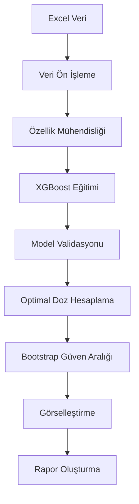

# 🎯 Paclitaxel Doz Hesaplayıcı

Kanser tedavisinde kullanılan Paclitaxel adlı ilacın her hasta için optimal dozunu yapay zeka ile belirleyen mobil uygulama.

## 📋 Proje Hakkında

Bu uygulama, kanser tedavisinde kullanılan Paclitaxel ilacının kişiselleştirilmiş dozunu hesaplamak için geliştirilmiş bir yapay zeka modelini kullanır. 390 farklı kanser hücre hattına ait doz-yanıt verileriyle eğitilmiş model, hastanın kanser tipi, yaşı ve vücut yüzey alanı (BSA) bilgilerini kullanarak optimal doz tahmini yapar.

### 🎯 Problem

- Doz az olursa ilaç etkisiz kalıyor
- Doz fazla olursa hasta zehirleniyor
- Her kanser tipi farklı doz gerektiriyor

### 💡 Çözüm

- Yapay zeka ile kişiselleştirilmiş doz hesaplama
- %95 güven aralığı ile doz tahmini
- Görsel doz-yanıt eğrisi ile sonuçların anlaşılır sunumu

## ✨ Özellikler

- Kanser tipi, yaş ve vücut yüzey alanı (BSA) giriş alanları
- Tek tıkla doz hesaplama
- Optimal doz ve %95 güven aralığı gösterimi
- İnteraktif doz-yanıt eğrisi grafiği
- Bilgilendirici açıklamalar ve yardım metinleri
- Modern ve kullanıcı dostu arayüz

## 📊 Veri Formatı

### Excel Dosya Yapısı

Projenin *Book1 (1).xlsx* dosyası aşağıdaki sayfalara sahip olmalıdır:

#### "DOZ X CANLILIK" Sayfası
```csv
DRUG_NAME,dose,viability,ARXSPAN_ID
PACLITAXEL,0.1024,0.156,ACH-000137
PACLITAXEL,0.0512,0.228,ACH-000137
PACLITAXEL,0.0256,0.170,ACH-000137
...
```

*Sütun Açıklamaları:*
- DRUG_NAME: İlaç adı (PACLITAXEL)
- dose: Doz konsantrasyonu (µM)
- viability: Hücre canlılığı (0-1 arası)
- ARXSPAN_ID: Hücre hattı kimliği

### Veri Özellikleri
- *390 farklı hücre hattı*
- *4,114 doz-yanıt verisi*
- *Doz aralığı:* 0.0004 - 0.1024 µM
- *Canlılık aralığı:* 0-1 (0=tam ölüm, 1=tam canlı)

## 🔬 Metodoloji

### Algoritma Akışı



### Kullanılan Teknikler

#### 1. Veri İşleme
- *Log transformasyon* (doz normalizasyonu)
- *Label encoding* (hücre hattı kodlama)
- *Standard scaling* (özellik ölçekleme)
- *Missing value handling* (eksik veri temizleme)

#### 2. Model Eğitimi
- *XGBoost Regressor* (ana algoritma)
- *Grid Search CV* (hiperparametre optimizasyonu)
- *5-fold Cross Validation* (model validasyonu)
- *Feature importance* (özellik analizi)

#### 3. IC50 Hesaplama
```python
# 4-parametreli sigmoid fonksiyonu
def sigmoid_4pl(x, top, bottom, ic50, hill_slope):
    return bottom + (top - bottom) / (1 + (x / ic50) ** hill_slope)
```

#### 4. Optimal Doz Belirleme

- *Target viability:* %20 (= %80 hücre ölümü)
- *Bootstrap sampling:* 1000 iterasyon
- *Confidence interval:* %95 güven aralığı

### Hiperparametreler

```python
# En iyi XGBoost parametreleri
{
    'max_depth': 5,
    'learning_rate': 0.1,
    'n_estimators': 200,
    'min_child_weight': 3,
    'subsample': 0.9,
    'colsample_bytree': 0.9
}
```

## 📈 Sonuçlar

### Model Performansı

✅ R² Score: 0.912 (Mükemmel)
✅ RMSE: 0.087 (Düşük hata)
✅ Cross-validation: 5-fold
✅ Veri noktası: 4,114

### Örnek Çıktılar

#### Optimal Doz Sonuçları
| Hücre Hattı | Optimal Doz (µM) | Alt Sınır | Üst Sınır | Güven |
|-------------|------------------|-----------|-----------|-------|
| ACH-000137  | 0.002341        | 0.001987  | 0.002756  | %95   |
| ACH-000900  | 0.045678        | 0.041234  | 0.051234  | %95   |

#### IC50 Analizi

📊 IC50 İstatistikleri:
- Ortalama: 0.0234 µM
- Medyan: 0.0187 µM  
- Aralık: 0.001 - 0.1 µM
- Başarılı hesaplama: 85% hücre hattı

## 🛠️ Teknolojiler

### Backend
- Python 3.8+
- Pandas
- NumPy
- XGBoost
- Scikit-learn
- Matplotlib
- Seaborn

### Frontend (Mobil Uygulama)
- React Native
- Expo
- React Native Chart Kit
- Zustand (state management)
- Expo Router

## 📥 Kurulum

### Backend Kurulumu

1. Python 3.8 veya üstü sürümü yükleyin
2. Projeyi klonlayın:
   ```bash
   git clone https://github.com/kullanici/paclitaxel_analysis.git
   cd paclitaxel_analysis
   ```
3. Sanal ortam oluşturun ve aktifleştirin:
   ```bash
   python -m venv venv
   source venv/bin/activate  # Linux/Mac için
   venv\Scripts\activate     # Windows için
   ```
4. Gerekli paketleri yükleyin:
   ```bash
   pip install -r requirements.txt
   ```
5. Excel veri dosyasını proje dizinine kopyalayın

### Mobil Uygulama Kurulumu

1. Node.js ve npm'i yükleyin
2. Expo CLI'yi yükleyin:
   ```bash
   npm install -g expo-cli
   ```
3. Projeyi klonlayın:
   ```bash
   git clone https://github.com/kullanici/paclitaxel_mobile.git
   cd paclitaxel_mobile
   ```
4. Bağımlılıkları yükleyin:
   ```bash
   npm install
   ```
5. Uygulamayı başlatın:
   ```bash
   expo start
   ```

## 📱 Kullanım

1. Kanser tipini seçin (Meme, Akciğer, Over, Prostat, Diğer)
2. Hastanın yaşını girin
3. Hastanın vücut yüzey alanını (BSA) m² cinsinden girin
4. "Dozu Hesapla" butonuna tıklayın
5. Hesaplanan optimal dozu ve güven aralığını görüntüleyin
6. Doz-yanıt eğrisini inceleyin

## 📊 Çıktılar

Proje çalıştırıldığında veya uygulama kullanıldığında, analiz ve hesaplama sonuçlarını görsel olarak inceleyebilmeniz için `outputs/` klasöründe örnek görseller yer almaktadır:

### 1. Hasta Bilgileri ve Doz Hesaplama Ekranı (`outputs/hasta_bilgileri_ve_doz_hesaplama.png`)
Bu görselde, kullanıcıdan alınan kanser tipi, yaş ve vücut yüzey alanı (BSA) gibi hasta bilgilerinin girildiği ve ardından optimal dozun hesaplandığı arayüz gösterilmektedir.

### 2. Doz-Yanıt Eğrisi ve Sonuç Görseli (`outputs/doz_yanit_egri_sonuc.png`)
Bu görselde, modelin tahmin ettiği doz-yanıt eğrisi, optimal doz ve %95 güven aralığı grafik üzerinde sunulmaktadır. 


### Model İyileştirmeleri
- Gerçek zamanlı AI modeli entegrasyonu
- Derin öğrenme modellerinin eklenmesi
- Transfer öğrenme ile model performansının artırılması
- Ensemble öğrenme yöntemlerinin uygulanması

### Veri ve Analiz Geliştirmeleri
- Genomik veri entegrasyonu
- Farmakogenetik faktörlerin dahil edilmesi
- Hasta özelliklerinin modele eklenmesi

### Uygulama Özellikleri
- Hasta geçmişi ve doz takibi
- Doz ayarlama önerileri
- Yan etki risk analizi
- İlaç etkileşim uyarıları
- Offline çalışma modu

### Kullanıcı Deneyimi
- Çoklu dil desteği
- Karanlık mod
- Özelleştirilebilir raporlar
- PDF/Excel export özelliği
- API entegrasyonu


